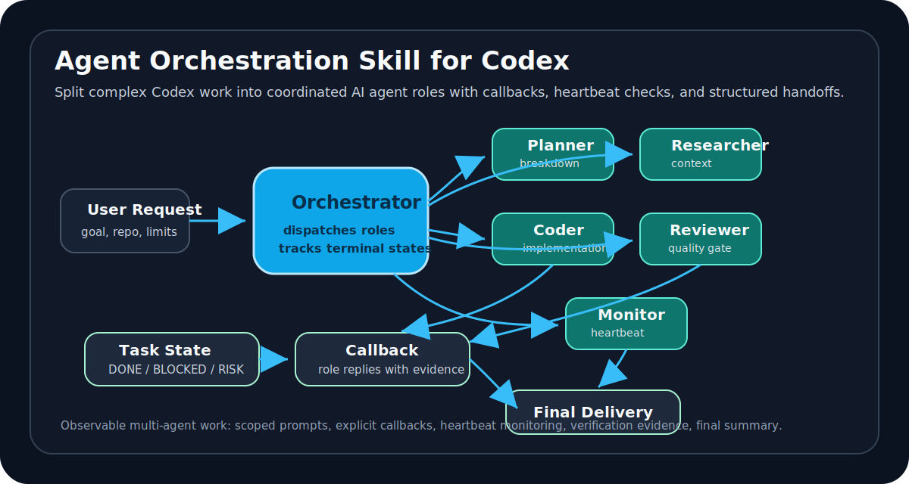
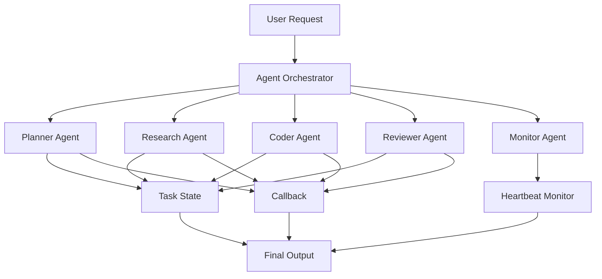

# Agent Orchestration Skill for Codex

[](https://github.com/lixuvip/agent-orchestration-skill/actions/workflows/validate.yml)
[](https://github.com/lixuvip/agent-orchestration-skill/releases)
[](https://opensource.org/licenses/MIT)

<p align="center">
  
</p>

<p align="center">
  <strong>Run multi-agent workflows in Codex with parallel roles, callbacks, heartbeat checks, and structured task handoffs.</strong>
</p>

<p align="center">
  <a href="README.zh-CN.md">中文说明</a> ·
  <a href="#quick-start">Quick Start</a> ·
  <a href="#demo-workflow">Demo Workflow</a> ·
  <a href="docs/examples.md">Examples</a> ·
  <a href="docs/installation.md">Installation</a>
</p>

<p align="center">
  <a href="https://github.com/lixuvip/agent-orchestration-skill/releases"></a>
  <a href="LICENSE"></a>
  <a href="https://github.com/lixuvip/agent-orchestration-skill/actions"></a>
  <a href="https://github.com/lixuvip/agent-orchestration-skill/stargazers"></a>
</p>



`agent-orchestration` is a lightweight Codex skill that helps one coordinator conversation split complex work across multiple AI agent roles: planner, researcher, coder, reviewer, release docs, QA, and monitor.

Instead of asking one agent to handle everything in a long linear thread, this skill gives Codex a repeatable orchestration layer for scoped delegation, callback-based progress reporting, heartbeat monitoring, task state tracking, and final handoff review.

## Quick Links

- [Install the skill](docs/installation.md)
- [Start in 3 minutes](docs/quickstart.md)
- [Coordinate a multi-project release](docs/tutorial.md)
- [Copy example prompts](docs/examples.md): [research](examples/simple-research-task.md), [coding + review](examples/coding-review-workflow.md), [product planning](examples/multi-agent-product-planning.md)
- [Read the Chinese docs](README.zh-CN.md)
- [Publish or fork your own version](docs/publishing.md)

## Why This Exists

Codex is powerful, but complex projects often need more than one linear agent thread. Long-running AI coding tasks can fail because progress is hidden, context gets mixed, or subtasks are forgotten.

This skill adds a small coordination layer that makes Codex workflows more observable, modular, and reliable:

- Split one goal into multiple role-specific agents.
- Give every role explicit scope, stop conditions, verification, and callback rules.
- Track task state with `DONE`, `DONE_WITH_CONCERNS`, `BLOCKED`, and `NEEDS_CONTEXT`.
- Use heartbeat monitoring for long-running or asynchronous work.
- Require the coordinator to inspect role output, risks, and verification before final delivery.

## Best For

- Multi-agent coding workflows.
- Research plus implementation pipelines.
- Product planning with role-based AI agents.
- QA and code review gates for AI-assisted development.
- Multi-repository release coordination.
- Long-running Codex tasks that need monitoring and callbacks.

## What It Solves

Use this skill when a task is too large or risky for one uninterrupted conversation:

- Multi-repository changes that need separate implementation and verification threads.
- Parallel work across product, engineering, QA, review, and release docs roles.
- Long-running Codex threads where the coordinator must poll status instead of relying on memory.
- Handoffs that require explicit changed files, verification commands, risks, and final status.
- Workflows where child threads should call back to the coordinator and a heartbeat automation should check status every 5 minutes.

## Quick Start

Install:

```bash
git clone https://github.com/lixuvip/agent-orchestration-skill.git
cd agent-orchestration-skill
./scripts/install.sh
```

Use in Codex:

```text
Use $agent-orchestration to coordinate this bug fix with one engineering thread and one QA thread.

Goal:
Fix the failing export option in the report generation flow.

Constraints:
- Engineer may edit application and test code.
- QA is read-only and must run the regression tests.
- Both roles must report exact commands and results.
```

## Demo Workflow



## Core Roles

| Role | Purpose |
| --- | --- |
| Coordinator | Breaks down the goal, dispatches role tasks, tracks status, and reviews final evidence. |
| Planner | Clarifies scope, acceptance criteria, and task order. |
| Researcher | Gathers context without changing files. |
| Coder | Implements scoped changes and reports exact files changed. |
| Reviewer | Checks quality, regressions, and risk areas. |
| QA Tester | Runs verification and reports exact commands and results. |
| Monitor | Polls long-running tasks and closes the loop when all roles reach terminal state. |

## Repository Layout

```text
.
├── skills/
│   └── agent-orchestration/
│       ├── SKILL.md
│       ├── agents/
│       │   └── openai.yaml
│       └── references/
│           ├── AUTOMATION_MONITORING.md
│           ├── COMMUNICATION_PROTOCOL.md
│           ├── PROJECT_CONTEXT.template.md
│           ├── ROLE_REGISTRY.template.md
│           ├── STATE_MACHINE.md
│           ├── TASK_BOARD.template.md
│           ├── WORKFLOWS.md
│           ├── examples/
│           ├── roles/
│           └── templates/
├── docs/
│   ├── installation.md
│   ├── installation.zh-CN.md
│   ├── quickstart.md
│   ├── quickstart.zh-CN.md
│   ├── tutorial.md
│   ├── tutorial.zh-CN.md
│   ├── examples.md
│   ├── examples.zh-CN.md
│   ├── publishing.md
│   └── publishing.zh-CN.md
├── examples/
├── scripts/
│   ├── install.sh
│   ├── smoke_test.py
│   └── validate.py
└── .github/workflows/validate.yml
```

## Install

Clone the repository and run the installer:

```bash
git clone https://github.com/lixuvip/agent-orchestration-skill.git
cd agent-orchestration-skill
./scripts/install.sh
```

The installer copies `skills/agent-orchestration` into:

```text
${CODEX_SKILLS_DIR:-${CODEX_HOME:-$HOME/.codex}/skills}/agent-orchestration
```

Restart Codex if the skill does not appear immediately.

For manual installation:

```bash
mkdir -p "${CODEX_HOME:-$HOME/.codex}/skills"
cp -R skills/agent-orchestration "${CODEX_HOME:-$HOME/.codex}/skills/"
```

Some Codex installations scan `$HOME/.agents/skills` for user-scoped skills. If that is your setup, install with:

```bash
CODEX_SKILLS_DIR="$HOME/.agents/skills" ./scripts/install.sh
```

## Usage

Invoke it explicitly in Codex:

```text
Use $agent-orchestration to split this task across engineering, QA, and code review threads. Create a 5-minute heartbeat monitor and summarize the final status when all roles finish.
```

Or describe a matching task and let Codex select it implicitly:

```text
Coordinate this release across three repositories. Have each project thread finish commits, document API contracts, and report verification results back to this coordinator thread.
```

## Minimal Workflow

1. The coordinator reads the project context and chooses a workflow.
2. The coordinator creates or selects role threads.
3. Each role receives a scoped task using `task_dispatch.template.md`.
4. Role threads reply using `role_reply.template.md`.
5. Long-running multi-thread work gets a callback rule and a 5-minute heartbeat monitor.
6. The coordinator reads every terminal result, checks verification, and delivers a final summary.

## Search Keywords

Codex skill, OpenAI Codex, AI agent orchestration, multi-agent workflow, parallel agents, subagents, task orchestration, role-based agents, callback workflow, heartbeat monitoring, structured handoff, coding agent, QA workflow, code review automation, release management, developer tools.

## Documentation

- Installation: [English](docs/installation.md) | [中文](docs/installation.zh-CN.md)
- Quickstart: [English](docs/quickstart.md) | [中文](docs/quickstart.zh-CN.md)
- Tutorial: [English](docs/tutorial.md) | [中文](docs/tutorial.zh-CN.md)
- Usage examples: [English](docs/examples.md) | [中文](docs/examples.zh-CN.md)
- Publishing guide: [English](docs/publishing.md) | [中文](docs/publishing.zh-CN.md)

## Validate

Run the repository validator:

```bash
python3 scripts/validate.py
python3 scripts/smoke_test.py
```

If you also have Codex's built-in `skill-creator` validator available, run it against the skill folder:

```bash
python3 ~/.codex/skills/.system/skill-creator/scripts/quick_validate.py skills/agent-orchestration
```

## Requirements

- Codex with skill support.
- Optional: Codex thread tools for creating, reading, and messaging role conversations.
- Optional: Codex automation tools for recurring heartbeat monitoring.

## Related Codex Documentation

- [Agent Skills](https://developers.openai.com/codex/skills)
- [Save workflows as skills](https://developers.openai.com/codex/use-cases/reusable-codex-skills)
- [Codex automations](https://developers.openai.com/codex/app/automations)

## License

MIT License. See [LICENSE](LICENSE).
