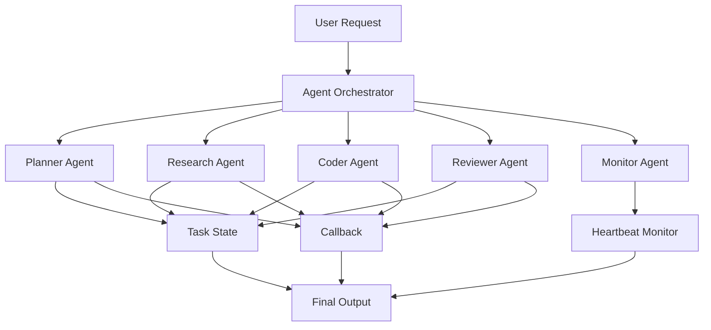

# Agent Orchestration Skill for Codex

[](https://github.com/lixuvip/agent-orchestration-skill/actions/workflows/validate.yml)
[](https://github.com/lixuvip/agent-orchestration-skill/releases)
[](https://opensource.org/licenses/MIT)

<p align="center">
  
</p>

<p align="center">
  <strong>Turn Codex into a coordinator for role threads, branch handoffs, callbacks, automations, QA/review gates, and project autopilot loops.</strong>
</p>

<p align="center">
  <a href="README.zh-CN.md">中文说明</a> ·
  <a href="#quick-start">Quick Start</a> ·
  <a href="#what-v014-adds">What's New</a> ·
  <a href="#demo-workflow">Demo Workflow</a> ·
  <a href="docs/examples.md">Examples</a> ·
  <a href="docs/installation.md">Installation</a>
</p>

<p align="center">
  <a href="https://github.com/lixuvip/agent-orchestration-skill/releases"></a>
  <a href="LICENSE"></a>
  <a href="https://github.com/lixuvip/agent-orchestration-skill/actions"></a>
  <a href="https://github.com/lixuvip/agent-orchestration-skill/stargazers"></a>
</p>


`agent-orchestration` is a lightweight Codex skill that helps one coordinator conversation split complex work across multiple AI agent roles: planner, researcher, coder, reviewer, release docs, QA, and monitor.

Instead of asking one agent to handle everything in a long linear thread, this skill gives Codex a repeatable orchestration layer for scoped delegation, callback-based progress reporting, heartbeat monitoring, task state tracking, and final handoff review.

It is especially useful when another Codex thread or branch is doing work and the main thread needs a reliable way to receive callbacks, request status, verify QA/review output, and decide whether a branch is ready to merge or push. It can also pair Codex automations with `AGENTS.md` project guidance so recurring work keeps moving toward a clear goal instead of becoming a loose reminder.

It can also add a read-only `agy` / Gemini review or research pass as an external second opinion. The coordinator still owns the final decision: every external finding or idea must be checked against the diff, repo context, or actual evidence before it affects planning, QA, repair, merge readiness, or delivery.

External-task quality is also logged per project in `.codex/agent-orchestration/agy-review-quality.jsonl` when writes are allowed. Review entries keep the default `task_type=review`; research entries set `task_type=research`. On first use in a project, the workflow can persist the stable agy-backed Gemini command-safety rule into the target `AGENTS.md`, then only treats logging as complete after the helper prints `LOG_WRITTEN`. That lets later Codex runs reuse the same guardrails without you restating them.

## Quick Links

- [Install the skill](docs/installation.md)
- [Start in 3 minutes](docs/quickstart.md)
- [Coordinate a multi-project release](docs/tutorial.md)
- [Copy example prompts](docs/examples.md): [research](examples/simple-research-task.md), [coding + review](examples/coding-review-workflow.md), [branch callback](examples/branch-callback-controller-loop.md), [project autopilot](examples/continuous-project-autopilot.md), [GitHub issue/PR autopilot](examples/github-issue-pr-autopilot.md), [product planning](examples/multi-agent-product-planning.md)
- [Review forward-test scenarios](docs/forward-tests.md)
- [Read the v0.1.4 release notes](docs/releases/v0.1.4.md)
- [Read the Chinese docs](README.zh-CN.md)
- [Publish or fork your own version](docs/publishing.md)

## What v0.1.4 Adds

`v0.1.4` hardens the Project Autopilot workflow from `v0.1.3` with CI-backed forward tests and clearer visual documentation.

| Area | What changed | Why it helps |
| --- | --- | --- |
| Forward-test guard | Adds `scripts/forward_test.py` and runs it in GitHub Actions. | Trigger coverage for heartbeat callbacks, cron Autopilot, no-op GitHub polling, and missing `AGENTS.md` guidance is checked before release. |
| Project Autopilot | Keeps the goal-driven recurring automation workflow for project progress. | Codex can continue checking and taking safe next steps until done criteria are met. |
| Automation memory | Keeps templates for memory, idempotency, latest effective updates, blockers, and posted messages. | Cron runs avoid duplicate comments, repeated status requests, and repeated work. |
| Escalation gates | Keeps explicit stop rules for merge, push, deploy, destructive changes, public API contract changes, and scope expansion. | Automation can move quickly without taking authority it does not have. |
| Visual docs | Adds Project Autopilot loop diagrams. | Users can understand the runtime loop before copying automation prompts. |

## Project Autopilot

Project Autopilot is a pattern for recurring Codex automation. It is for prompts like "keep working on this project until the checklist is complete" or "check every hour and take the next safe step."


Autopilot combines:

- `AGENTS.md` / `AGENTS.override.md` as persistent project guidance.
- A goal contract with done criteria, permissions, verification, cadence, and stop conditions.
- Heartbeat automation for current-thread follow-up and callback polling.
- Cron automation for durable workspace or worktree progress.
- Automation memory so each run compares the latest effective update before posting comments or repeating work.
- Escalation reports when merge, push, deploy, scope expansion, or repeated verification failure needs user input.
- Forward-test scenarios and filled examples for no-op ticks, escalation, goal contracts, and automation memory.

## Why This Exists

Codex is powerful, but complex projects often need more than one linear agent thread. Long-running AI coding tasks can fail because progress is hidden, context gets mixed, or subtasks are forgotten.

This skill adds a small coordination layer that makes Codex workflows more observable, modular, and reliable:

- Split one goal into multiple role-specific agents.
- Give every role explicit scope, stop conditions, verification, and callback rules.
- Confirm branch, thread, callback, merge, and push behavior before risky orchestration.
- Track task state with `DONE`, `DONE_WITH_CONCERNS`, `BLOCKED`, and `NEEDS_CONTEXT`.
- Use heartbeat monitoring for long-running or asynchronous work.
- Use project autopilot for recurring automation that can continue a workspace toward a defined goal.
- Add an optional read-only `agy` / Gemini review pass while guarding against scope drift and unsupported test claims.
- Run parallel Codex + Gemini research for repo surveys, option comparison, or idea expansion without forcing those tasks into review mode.
- Preserve per-task quality logs for later prompt, model, and scope tuning.
- Require the coordinator to inspect role output, risks, and verification before final delivery.
- Run merge-readiness checks before branch finalization.

## Best For

- Multi-agent coding workflows.
- Research plus implementation pipelines.
- Product planning with role-based AI agents.
- QA and code review gates for AI-assisted development.
- Optional external `agy` / Gemini review gates for high-risk diffs or second-opinion review.
- Optional external `agy` / Gemini research passes for implementation options, repo surveys, and idea expansion.
- Multi-repository release coordination.
- Long-running Codex tasks that need monitoring and callbacks.
- Branch/worktree handoffs that need status requests, QA gates, and merge readiness.
- Recurring project automation that should read `AGENTS.md`, keep memory, choose one safe next step per run, and stop when the goal is met.

## What It Solves

Use this skill when a task is too large or risky for one uninterrupted conversation:

- Multi-repository changes that need separate implementation and verification threads.
- Parallel work across product, engineering, QA, review, and release docs roles.
- Long-running Codex threads where the coordinator must poll status instead of relying on memory.
- Handoffs that require explicit changed files, verification commands, risks, and final status.
- Workflows where child threads should call back to the coordinator and a heartbeat automation should check status every 5 minutes.
- Branch or worktree workflows that need status requests, coordinator callbacks, and merge-readiness checks.
- Projects that need recurring cron automation to inspect issues/PRs/tests, act idempotently, and keep moving without losing project rules.

## Optional Agy / Gemini Review

When `agy` is installed locally, the coordinator can run a bounded external review after Codex implementation or before accepting a branch handoff. This workflow uses `references/AGY_GEMINI_REVIEW.md` plus prompt, quality, and dedicated report templates under `references/templates/`.

The standard review model is `Gemini 3.5 Flash (High)` for the ordinary external second opinion and for full-project baseline sweeps. For full-project audits or user-requested comparisons, the workflow uses dual Codex + Gemini review: a Codex reviewer role inspects the same scope while `agy` runs independently, then the coordinator compares agreed findings, Gemini-only findings, Codex-only findings, rejected findings, and verification evidence. In this workflow, Gemini always means Gemini through local `agy`, never the standalone `gemini` CLI. The workflow first uses `scripts/ensure_agy_review_agents_guidance.py` to make the stable command-safety rule durable in the target `AGENTS.md` when writes are allowed, and that guidance gate now happens before any `agy` health check or model discovery. Capability discovery for this path is `command -v agy` and `agy models` only; do not probe `command -v gemini`, `gemini --version`, or `gemini --help`. The review prompt templates now also carry explicit negative guardrails so the external pass does not drift into CLI/auth narration, fake command claims, scope inflation, or generic filler. The workflow then uses normal read-only print mode with `--sandbox` through `scripts/run_agy_print.py`, which keeps the prompt immediately after `--print`, supports `--add-dir <project_root>` so repository reviews do not accidentally inspect Antigravity scratch, rejects zero-byte stdout by default, and can enforce `--expect-substring <token>` for health checks or structured schemas. If a process probes or opens `gemini` CLI, or returns `403` from that CLI, treat that as `WRONG_EXECUTION_SURFACE` and rerun through `agy`. The coordinator still classifies every external finding, displays results as a dedicated review report in chat, and runs `scripts/append_agy_review_quality_log.py` to append review-quality records to `.codex/agent-orchestration/agy-review-quality.jsonl` unless the target project is read-only or privacy rules block logging.

## Optional Agy / Gemini Research

When you want Gemini involved in research instead of only in review, the coordinator can run a parallel Codex + Gemini research pass. This workflow uses `references/AGY_GEMINI_RESEARCH.md` plus prompt, quality, log, and dedicated report templates under `references/templates/`.

The standard research model is also `Gemini 3.5 Flash (High)` for repo surveys and option framing. The coordinator must still do its own repo reading and, when current external facts matter, browse primary sources directly. Here too, Gemini means Gemini through local `agy`, not the standalone `gemini` CLI. The guidance gate runs before any external research preflight in writable repos, and capability discovery is `command -v agy` plus `agy models` only. The research prompt templates now include explicit negative guardrails against CLI/auth drift, scope inflation, fake validation, and generic brainstorming filler. If a process probes or opens `gemini` CLI, or returns `403` from that CLI, treat that as `WRONG_EXECUTION_SURFACE` and rerun through `agy`. Gemini's role is to add a second research stream, not to replace Codex verification. Results are displayed as a dedicated research report with agreed points, Gemini-only points, Codex-only points, rejected or speculative points, and concrete next actions. The same `scripts/append_agy_review_quality_log.py` helper appends the research-quality record to `.codex/agent-orchestration/agy-review-quality.jsonl` with `task_type=research`.

## Example: Branch Callback

```text
Use $agent-orchestration to coordinate branch work with direct callback to the main coordinator thread.

Create or continue a dedicated engineering branch/worktree.
Keep QA read-only.
Require every role to callback to the coordinator thread.
Create heartbeat monitoring if the work is long-running.
Run merge readiness before merging, pushing, or telling the user the branch is ready.
```

## Example: Project Autopilot

```text
Use $agent-orchestration to create a project autopilot loop.

Read AGENTS.md and project docs first.
Create a goal contract with done criteria, allowed autonomous actions, verification commands, cadence, and stop conditions.
Use cron automation for workspace progress and heartbeat only for coordinator-thread callbacks.
Maintain automation memory and compare the latest effective update before repeating work or posting comments.
Escalate before merge, push, deploy, publish, destructive changes, public API contract changes, or scope expansion.
```

## Quick Start

Install:

```bash
git clone https://github.com/lixuvip/agent-orchestration-skill.git
cd agent-orchestration-skill
./scripts/install.sh
```

Use in Codex:

```text
Use $agent-orchestration to coordinate this bug fix with one engineering thread and one QA thread.

Goal:
Fix the failing export option in the report generation flow.

Constraints:
- Engineer may edit application and test code.
- QA is read-only and must run the regression tests.
- Both roles must report exact commands and results.
```

## Demo Workflow



## Core Roles

| Role | Purpose |
| --- | --- |
| Coordinator | Breaks down the goal, dispatches role tasks, tracks status, and reviews final evidence. |
| Planner | Clarifies scope, acceptance criteria, and task order. |
| Researcher | Gathers context without changing files. |
| Coder | Implements scoped changes and reports exact files changed. |
| Reviewer | Checks quality, regressions, and risk areas. |
| QA Tester | Runs verification and reports exact commands and results. |
| Monitor | Polls long-running tasks and closes the loop when all roles reach terminal state. |

## Repository Layout

```text
.
├── skills/
│   └── agent-orchestration/
│       ├── SKILL.md
│       ├── agents/
│       │   └── openai.yaml
│       └── references/
│           ├── AUTOMATION_MONITORING.md
│           ├── AUTOMATION_TOOLING.md
│           ├── AGY_GEMINI_REVIEW.md
│           ├── AGY_GEMINI_RESEARCH.md
│           ├── COMMUNICATION_PROTOCOL.md
│           ├── CONTROLLER_LOOP.md
│           ├── ORCHESTRATION_INTAKE.md
│           ├── PROJECT_AUTOPILOT.md
│           ├── PROJECT_INSTRUCTIONS_DISCOVERY.md
│           ├── PROJECT_CONTEXT.template.md
│           ├── ROLE_REGISTRY.template.md
│           ├── STATE_MACHINE.md
│           ├── TASK_BOARD.template.md
│           ├── WORKFLOWS.md
│           ├── examples/
│           ├── roles/
│           └── templates/
├── docs/
│   ├── installation.md
│   ├── installation.zh-CN.md
│   ├── quickstart.md
│   ├── quickstart.zh-CN.md
│   ├── tutorial.md
│   ├── tutorial.zh-CN.md
│   ├── examples.md
│   ├── examples.zh-CN.md
│   ├── forward-tests.md
│   ├── images/
│   ├── releases/
│   ├── publishing.md
│   └── publishing.zh-CN.md
├── examples/
├── scripts/
│   ├── install.sh
│   ├── smoke_test.py
│   ├── forward_test.py
│   └── validate.py
└── .github/workflows/validate.yml
```

## Install

Clone the repository and run the installer:

```bash
git clone https://github.com/lixuvip/agent-orchestration-skill.git
cd agent-orchestration-skill
./scripts/install.sh
```

The installer copies `skills/agent-orchestration` into:

```text
${CODEX_SKILLS_DIR:-${CODEX_HOME:-$HOME/.codex}/skills}/agent-orchestration
```

Restart Codex if the skill does not appear immediately.

For manual installation:

```bash
mkdir -p "${CODEX_HOME:-$HOME/.codex}/skills"
cp -R skills/agent-orchestration "${CODEX_HOME:-$HOME/.codex}/skills/"
```

Some Codex installations scan `$HOME/.agents/skills` for user-scoped skills. If that is your setup, install with:

```bash
CODEX_SKILLS_DIR="$HOME/.agents/skills" ./scripts/install.sh
```

## Usage

Invoke it explicitly in Codex:

```text
Use $agent-orchestration to split this task across engineering, QA, and code review threads. Create a 5-minute heartbeat monitor and summarize the final status when all roles finish.
```

Or describe a matching task and let Codex select it implicitly:

```text
Coordinate this release across three repositories. Have each project thread finish commits, document API contracts, and report verification results back to this coordinator thread.
```

## Minimal Workflow

1. The coordinator reads the project context and chooses a workflow.
2. The coordinator creates or selects role threads.
3. Each role receives a scoped task using `task_dispatch.template.md`.
4. Role threads reply using `role_reply.template.md`.
5. Long-running multi-thread work gets a callback rule and a 5-minute heartbeat monitor.
6. The coordinator reads every terminal result, checks verification, and delivers a final summary.

## Search Keywords

Codex skill, Codex skills, Agent Skills, OpenAI Codex, AGENTS.md, AGENTS.override.md, AI agent orchestration, multi-agent workflow, project autopilot, Codex automations, cron automation, heartbeat automation, GitHub issue automation, PR automation, parallel agents, parallel coding, git worktrees, subagents, task orchestration, role-based agents, callback workflow, heartbeat monitoring, structured handoff, coding agent, QA workflow, code review automation, agy Gemini review, Antigravity review, external model review, release management, developer tools.

## Documentation

- Installation: [English](docs/installation.md) | [中文](docs/installation.zh-CN.md)
- Quickstart: [English](docs/quickstart.md) | [中文](docs/quickstart.zh-CN.md)
- Tutorial: [English](docs/tutorial.md) | [中文](docs/tutorial.zh-CN.md)
- Usage examples: [English](docs/examples.md) | [中文](docs/examples.zh-CN.md)
- Forward tests: [docs/forward-tests.md](docs/forward-tests.md)
- Publishing guide: [English](docs/publishing.md) | [中文](docs/publishing.zh-CN.md)

## Validate

Run the repository validator:

```bash
python3 scripts/validate.py
python3 scripts/smoke_test.py
python3 scripts/forward_test.py
```

If you also have Codex's built-in `skill-creator` validator available, run it against the skill folder:

```bash
python3 ~/.codex/skills/.system/skill-creator/scripts/quick_validate.py skills/agent-orchestration
```

## Requirements

- Codex with skill support.
- Optional: Codex thread tools for creating, reading, and messaging role conversations.
- Optional: Codex automation tools for recurring heartbeat monitoring and workspace cron autopilot.
- Optional: local `agy` CLI with Gemini models for external read-only review or research passes.
- Optional: Project `AGENTS.md` / `AGENTS.override.md` guidance for durable repository rules.

## Related Codex Documentation

- [Agent Skills](https://developers.openai.com/codex/skills)
- [Custom instructions with AGENTS.md](https://developers.openai.com/codex/guides/agents-md)
- [Save workflows as skills](https://developers.openai.com/codex/use-cases/reusable-codex-skills)
- [Codex automations](https://developers.openai.com/codex/app/automations)

## License

MIT License. See [LICENSE](LICENSE).
