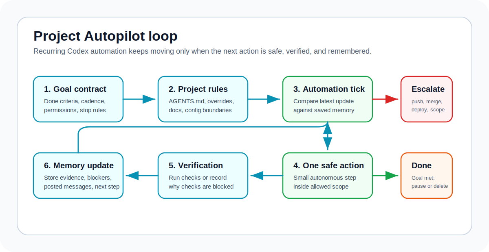
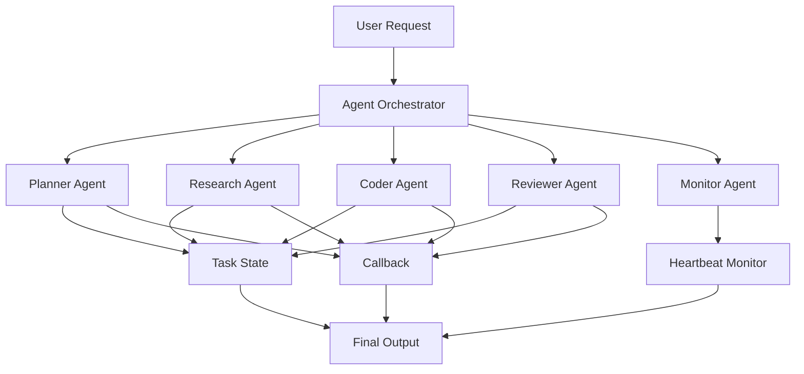

# Agent Orchestration Skill for Codex

<p align="center">
  
</p>

<p align="center">
  <strong>Turn Codex into a coordinator for role threads, branch handoffs, callbacks, automations, QA/review gates, and project autopilot loops.</strong>
</p>

<p align="center">
  <a href="README.zh-CN.md">中文说明</a> ·
  <a href="#quick-start">Quick Start</a> ·
  <a href="#v020-progressive-orchestration">v0.2.0</a> ·
  <a href="#demo-workflow">Demo Workflow</a> ·
  <a href="docs/examples.md">Examples</a> ·
  <a href="docs/installation.md">Installation</a>
</p>

<p align="center">
  <a href="https://github.com/lixuvip/agent-orchestration-skill/releases"></a>
  <a href="LICENSE"></a>
  <a href="https://github.com/lixuvip/agent-orchestration-skill/actions"></a>
  <a href="https://github.com/lixuvip/agent-orchestration-skill/stargazers"></a>
</p>


`agent-orchestration` is a Codex skill for work that needs more than one uninterrupted agent loop: role delegation, user-visible thread coordination, branch/worktree handoffs, QA and review gates, callbacks, finite monitoring, recurring project automation, or an external `agy` / Gemini second opinion.

The skill deliberately does not turn every request into a multi-agent workflow. It selects the minimum safe route, loads only the matching capability pack and templates, and keeps the coordinator responsible for scope, evidence, authority, and final acceptance.

## Choose The Right Weight

| Mode | Use it when | Runtime context |
| --- | --- | --- |
| Lite | One-shot work in the current conversation, including a read-only external-model pass. | No core pack, task board, callback envelope, heartbeat, cron, or memory. |
| Standard | Multiple roles, async/user-visible threads, cross-repository handoffs, finite long work, or formal QA/review/release gates. | One language version of `COORDINATION_RUNBOOK.md` plus only the templates actually needed. |
| Durable | Work must recur or recover across ticks until explicit done criteria are met. | Standard pack plus the matching `PROJECT_AUTOPILOT.md`; goal contract, memory, lease, lifecycle, and escalation templates. |

`scripts/route_orchestration.py` makes this decision deterministic when the route is not obvious. A requested lighter mode cannot bypass the minimum safety requirements. External review/research is an independent modifier, not an automatic upgrade.

## Per-Thread Thinking Selection

For every new user-visible thread, the coordinator now evaluates cognitive difficulty separately from Lite/Standard/Durable routing and selects the lowest adequate supported `thinking` effort. Mechanical work may use `minimal` or `low`; normal implementation usually uses `medium`; ambiguous architecture, security, or high-risk review may justify `high` or `xhigh`. The coordinator records requested/applied effort and rationale, never changes `model` unless the user explicitly requested one, and reports `INHERITED` or `UNSUPPORTED` when the creation surface cannot apply an override.

## v0.2.0: Progressive Orchestration

`v0.2.0` unifies the features added since `v0.1.4` into one smaller, safer operating model.

| Capability | What it provides | Why it matters |
| --- | --- | --- |
| Progressive loading | `SKILL.md` is 42 lines; 14 overlapping core references are consolidated into four bilingual capability-pack files. | Simple work stays light; complex work still has a complete contract. |
| Versioned callbacks | `ORCHESTRATION_EVENT_V1` carries attempt, nonce, coordinator epoch, unique event ID, and exact artifact identity. | Duplicate and stale callbacks are no-ops instead of state corruption. |
| Commit-pinned gates | Role status, gate verdict, and coordinator state remain separate; QA/review verdicts name the inspected SHA. | Role `DONE` cannot impersonate acceptance, and a later code commit invalidates old evidence. |
| Recoverable automation | File-locked leases, monotonic fencing tokens, idempotency keys, and `ACTIVE -> DRAINING -> CLOSED`. | Overlapping or resumed ticks cannot duplicate messages, overwrite memory, or close a newer run. |
| Durable project progress | Goal contract, project instructions, one safe action per tick, durable memory, no-op polling, and escalation gates. | Autopilot keeps moving toward done criteria without silently gaining merge, push, deploy, or scope authority. |
| Bounded external review/research | Sandboxed `agy` helpers, allowlisted context bundles, structured output checks, and a Codex-owned quality ledger. | Gemini remains a read-only second opinion until Codex verifies and accepts its output. |
| Auditable installation | Clean-source enforcement, staged replacement, provenance manifest, parity check, retained previous copy, dry-run, and restore. | The installed skill can be traced, verified, and rolled back. |
| Regression guards | Static, smoke, forward, protocol, automation, routing, scale-budget, built-in skill, and diff checks. | Safety semantics and context budgets are executable release requirements. |

Full release notes and migration guidance: [v0.2.0](docs/releases/v0.2.0.md).

## Core Guarantees

- Every delegated task has one owner and explicit editable, read-only, and out-of-scope boundaries.
- Shared-file edits are isolated or serialized; routing never makes overlapping writes safe.
- Silence is never completion. Verification claims must name commands that actually ran and their results.
- Role `DONE` moves work into coordinator review; only coordinator `ACCEPTED` is delivery.
- QA/review evidence is valid only for the exact artifact inspected.
- Recurring ticks verify lease ownership before external writes, messages, cleanup, or memory commits.
- Merge, push, deploy, publish, destructive actions, spending, secrets, and scope expansion remain behind user/project authority.

## Best Fit

- An engineer branch needs a read-only QA pass and callback to the main coordinator.
- Multiple repositories or worktrees must be finalized against one contract.
- A release needs implementation, QA, review, docs, and exact merge-readiness evidence.
- A long-running role needs finite heartbeat monitoring and reliable cleanup.
- An issue, PR, checklist, or workspace should progress every few hours until measurable done criteria pass.
- A risky diff or design choice benefits from independent Codex and `agy` / Gemini review or research.

Keep single-file edits, explanations, and one-shot debugging in the current conversation when independent ownership, async recovery, formal gates, or recurrence would not help.

## Quick Links

- [Install the skill](docs/installation.md)
- [Start in 3 minutes](docs/quickstart.md)
- [Read the v0.2.0 release and migration notes](docs/releases/v0.2.0.md)
- [Coordinate a multi-project release](docs/tutorial.md)
- [Copy ready-to-use prompts](docs/examples.md)
- [Review forward-test scenarios](docs/forward-tests.md)
- [Read the Chinese documentation](README.zh-CN.md)
- [Publish or fork your own version](docs/publishing.md)

## Project Autopilot

Project Autopilot is a pattern for recurring Codex automation. It is for prompts like "keep working on this project until the checklist is complete" or "check every hour and take the next safe step."



Autopilot combines:

- `AGENTS.md` / `AGENTS.override.md` as persistent project guidance.
- A goal contract with done criteria, permissions, verification, cadence, and stop conditions.
- Heartbeat automation for current-thread follow-up and callback polling.
- Cron automation for durable workspace or worktree progress.
- Automation memory so each run compares the latest effective update, processed event IDs, and action keys before posting comments or repeating work.
- A file-locked lease and fencing token so overlapping ticks cannot both act or overwrite newer memory.
- `ACTIVE -> DRAINING -> CLOSED` heartbeat shutdown with one final summary and tool-confirmed cleanup.
- Escalation reports when merge, push, deploy, scope expansion, or repeated verification failure needs user input.
- Forward-test scenarios and filled examples for no-op ticks, escalation, goal contracts, and automation memory.

## Optional Agy / Gemini Review

When `agy` is installed locally, the coordinator can run a bounded external review after Codex implementation or before accepting a branch handoff. A one-shot second opinion remains Lite unless the wider task actually needs Standard or Durable coordination. This workflow uses `references/AGY_GEMINI_REVIEW.md` plus prompt, quality, and dedicated report templates under `references/templates/`.

`agy` is opt-in and optional. If the user asks for an audit without naming an external model, the coordinator asks once whether to add `agy`; a decline or no confirmation continues Codex-only without probing. After opt-in, availability is checked once per goal and host. Missing or unhealthy installations are cached, reported once, and not retried until the goal or environment changes or the user requests a recheck.

The standard review model is `Gemini 3.5 Flash (High)`. For broad audits or user-requested comparisons, the workflow runs independent Codex and Gemini reviews, then compares agreed, model-only, rejected, and verified findings. Gemini always means Gemini through local `agy`, never the standalone `gemini` CLI. `scripts/run_agy_print.py` fixes the pass to sandboxed print mode, rejects unsafe edit-mode flags, enforces a host timeout and output limit, and treats empty or structurally invalid output as failure. Diff-only review needs no repository attachment; source-backed review uses an allowlisted bundle created by `scripts/build_agy_context_bundle.py`. Whole-repository disclosure, persistent `AGENTS.md` guidance, and project-local quality logging each require explicit authorization.

## Optional Agy / Gemini Research

When you want Gemini involved in research instead of only in review, the coordinator can run a parallel Codex + Gemini research pass. This workflow uses `references/AGY_GEMINI_RESEARCH.md` plus prompt, quality, log, and dedicated report templates under `references/templates/`.

The same opt-in and availability cache applies to research: without confirmation there is no `agy` probe, and an unavailable tool falls back immediately to Codex-only work.

The standard research model is also `Gemini 3.5 Flash (High)` for repo surveys and option framing. Codex still reads the repository and verifies current external facts from primary sources. The external stream receives a bounded prompt or allowlisted context bundle, never an automatically expanded whole-repository attachment. Results are shown as agreed points, Gemini-only points, Codex-only points, rejected or speculative points, and concrete next actions. Research-quality records use `task_type=research` in the same Codex-owned external-review ledger.

## Example: Branch Callback

```text
Use $agent-orchestration to coordinate branch work with direct callback to the main coordinator thread.

Create or continue a dedicated engineering branch/worktree.
Keep QA read-only.
Require every role to callback to the coordinator thread.
Create heartbeat monitoring if the work is long-running.
Run merge readiness before merging, pushing, or telling the user the branch is ready.
```

## Example: Project Autopilot

```text
Use $agent-orchestration to create a project autopilot loop.

Read AGENTS.md and project docs first.
Create a goal contract with done criteria, allowed autonomous actions, verification commands, cadence, and stop conditions.
Use cron automation for workspace progress and heartbeat only for coordinator-thread callbacks.
Maintain automation memory and compare the latest effective update before repeating work or posting comments.
Acquire a fenced lease for every tick, verify it before side effects and memory writes, and discard stale-owner results.
Escalate before merge, push, deploy, publish, destructive changes, public API contract changes, or scope expansion.
```

## Quick Start

Install:

```bash
git clone https://github.com/lixuvip/agent-orchestration-skill.git
cd agent-orchestration-skill
./scripts/install.sh
```

Use in Codex:

```text
Use $agent-orchestration to coordinate this bug fix with one engineering thread and one QA thread.

Goal:
Fix the failing export option in the report generation flow.

Constraints:
- Engineer may edit application and test code.
- QA is read-only and must run the regression tests.
- Both roles must report exact commands and results.
```

## Demo Workflow



## Core Roles

| Role | Purpose |
| --- | --- |
| Coordinator | Breaks down the goal, dispatches role tasks, tracks status, and reviews final evidence. |
| Planner | Clarifies scope, acceptance criteria, and task order. |
| Researcher | Gathers context without changing files. |
| Coder | Implements scoped changes and reports exact files changed. |
| Reviewer | Checks quality, regressions, and risk areas. |
| QA Tester | Runs verification and reports exact commands and results. |
| Monitor | Polls long-running tasks, summarizes terminal role states into coordinator review, and closes its automation lifecycle. |

## Repository Layout

```text
.
├── skills/
│   └── agent-orchestration/
│       ├── SKILL.md
│       ├── agents/
│       │   └── openai.yaml
│       ├── scripts/
│       │   ├── automation_lease.py
│       │   ├── heartbeat_lifecycle.py
│       │   ├── orchestration_event.py
│       │   └── route_orchestration.py
│       └── references/
│           ├── AGY_GEMINI_REVIEW.md
│           ├── AGY_GEMINI_RESEARCH.md
│           ├── COORDINATION_RUNBOOK.md
│           ├── COORDINATION_RUNBOOK.zh-CN.md
│           ├── PROJECT_AUTOPILOT.md
│           ├── PROJECT_AUTOPILOT.zh-CN.md
│           ├── PROJECT_CONTEXT.template.md
│           ├── ROLE_REGISTRY.template.md
│           ├── TASK_BOARD.template.md
│           ├── examples/
│           ├── roles/
│           └── templates/
├── docs/
│   ├── installation.md
│   ├── installation.zh-CN.md
│   ├── quickstart.md
│   ├── quickstart.zh-CN.md
│   ├── tutorial.md
│   ├── tutorial.zh-CN.md
│   ├── examples.md
│   ├── examples.zh-CN.md
│   ├── forward-tests.md
│   ├── images/
│   ├── releases/
│   ├── publishing.md
│   └── publishing.zh-CN.md
├── examples/
├── scripts/
│   ├── install.sh
│   ├── install_skill.py
│   ├── automation_test.py
│   ├── protocol_test.py
│   ├── routing_test.py
│   ├── scale_test.py
│   ├── smoke_test.py
│   ├── forward_test.py
│   └── validate.py
└── .github/workflows/validate.yml
```

## Install

Clone the repository and run the installer:

```bash
git clone https://github.com/lixuvip/agent-orchestration-skill.git
cd agent-orchestration-skill
./scripts/install.sh
```

The installer copies `skills/agent-orchestration` into:

```text
${CODEX_SKILLS_DIR:-${CODEX_HOME:-$HOME/.codex}/skills}/agent-orchestration
```

The installer validates first, refuses a dirty source tree by default, stages replacement atomically, records source provenance, and retains the previous install for rollback. Use `./scripts/install.sh --dry-run` to preview, `--allow-dirty` only for an intentional local snapshot, and `./scripts/install.sh --restore` to restore the retained previous copy.

Restart Codex if the skill does not appear immediately.

Manual copying bypasses provenance and rollback. If you still need it:

```bash
mkdir -p "${CODEX_HOME:-$HOME/.codex}/skills"
cp -R skills/agent-orchestration "${CODEX_HOME:-$HOME/.codex}/skills/"
```

Some Codex installations scan `$HOME/.agents/skills` for user-scoped skills. If that is your setup, install with:

```bash
CODEX_SKILLS_DIR="$HOME/.agents/skills" ./scripts/install.sh
```

## Usage

Invoke it explicitly in Codex:

```text
Use $agent-orchestration to split this task across engineering, QA, and code review threads. Create a 5-minute heartbeat monitor and summarize the final status when all roles finish.
```

Or describe a matching task and let Codex select it implicitly:

```text
Coordinate this release across three repositories. Have each project thread finish commits, document API contracts, and report verification results back to this coordinator thread.
```

## Minimal Workflow

1. The coordinator chooses the minimum safe Lite, Standard, or Durable route.
2. Standard or Durable work creates scoped dispatch identities and selects isolated role threads/worktrees where needed.
3. Each asynchronous role receives a versioned dispatch using `task_dispatch.template.md` and replies with `ORCHESTRATION_EVENT_V1`.
4. The coordinator validates, deduplicates, and rejects stale callbacks before updating state.
5. Long-running Standard work uses a leased heartbeat; Durable work uses a goal contract, memory, cron, and fencing.
6. Terminal role status moves work to `IN_REVIEW`. The coordinator accepts delivery only after current artifact-pinned gates pass.

## Search Keywords

Codex skill, Codex skills, Agent Skills, OpenAI Codex, AGENTS.md, AGENTS.override.md, AI agent orchestration, multi-agent workflow, project autopilot, Codex automations, cron automation, heartbeat automation, GitHub issue automation, PR automation, parallel agents, parallel coding, git worktrees, subagents, task orchestration, role-based agents, callback workflow, heartbeat monitoring, structured handoff, coding agent, QA workflow, code review automation, agy Gemini review, Antigravity review, external model review, release management, developer tools.

## Documentation

- Installation: [English](docs/installation.md) | [中文](docs/installation.zh-CN.md)
- Quickstart: [English](docs/quickstart.md) | [中文](docs/quickstart.zh-CN.md)
- Tutorial: [English](docs/tutorial.md) | [中文](docs/tutorial.zh-CN.md)
- Usage examples: [English](docs/examples.md) | [中文](docs/examples.zh-CN.md)
- Forward tests: [docs/forward-tests.md](docs/forward-tests.md)
- Publishing guide: [English](docs/publishing.md) | [中文](docs/publishing.zh-CN.md)

## Validate

Run the repository validator:

```bash
python3 scripts/validate.py
python3 scripts/smoke_test.py
python3 scripts/forward_test.py
python3 scripts/protocol_test.py
python3 scripts/automation_test.py
python3 scripts/routing_test.py
python3 scripts/scale_test.py
git diff --check
```

If you also have Codex's built-in `skill-creator` validator available, run it against the skill folder:

```bash
python3 ~/.codex/skills/.system/skill-creator/scripts/quick_validate.py skills/agent-orchestration
```

## Requirements

- Codex with skill support.
- Optional: Codex thread tools for creating, reading, and messaging role conversations.
- Optional: Codex automation tools for recurring heartbeat monitoring and workspace cron autopilot.
- Recurring lease helpers require a local POSIX-style filesystem with advisory locks and atomic rename semantics.
- Optional: local `agy` CLI with Gemini models for external read-only review or research passes.
- Optional: Project `AGENTS.md` / `AGENTS.override.md` guidance for durable repository rules.

## Related Codex Documentation

- [Agent Skills](https://developers.openai.com/codex/skills)
- [Custom instructions with AGENTS.md](https://developers.openai.com/codex/guides/agents-md)
- [Save workflows as skills](https://developers.openai.com/codex/use-cases/reusable-codex-skills)
- [Codex automations](https://developers.openai.com/codex/app/automations)

## License

MIT License. See [LICENSE](LICENSE).
