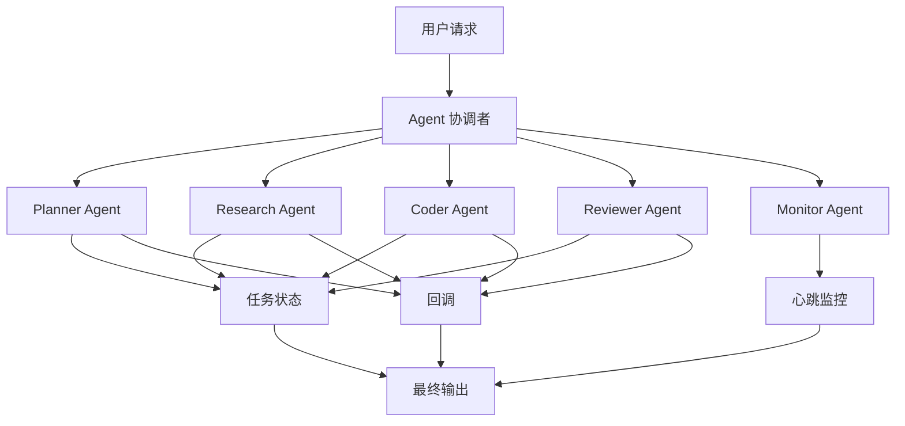

# Agent Orchestration Codex Skill

<p align="center">
  
</p>

<p align="center">
  <strong>让 Codex 主线程变成协调者：分发角色线程、接收分支回调、管理自动化、跑 QA/审查门禁，并持续推进项目目标。</strong>
</p>

<p align="center">
  <a href="README.md">English</a> ·
  <a href="#快速开始">快速开始</a> ·
  <a href="#未发布可靠性优化">可靠性优化</a> ·
  <a href="#演示流程">演示流程</a> ·
  <a href="docs/examples.zh-CN.md">使用示例</a> ·
  <a href="docs/installation.zh-CN.md">安装说明</a>
</p>

<p align="center">
  <a href="https://github.com/lixuvip/agent-orchestration-skill/releases"></a>
  <a href="LICENSE"></a>
  <a href="https://github.com/lixuvip/agent-orchestration-skill/actions"></a>
  <a href="https://github.com/lixuvip/agent-orchestration-skill/stargazers"></a>
</p>


`agent-orchestration` 是一个可以从 Lite 一次性任务扩展到 Standard 多角色协调，再扩展到 Durable 项目 Autopilot 的 Codex skill。它用于角色化任务分发、QA/审查门禁、发布协作、版本化回调和自动化收口，但不会强迫简单任务使用重流程。

与其让一个 Agent 在一条很长的会话里独自处理所有事情，这个 skill 会让一个 Codex 会话担任协调者，把任务拆给 planner、researcher、coder、reviewer、release docs、QA 和 monitor 等角色，再用版本化事件、commit 固定证据、并发租约和协调者验收收口。

它尤其适合“另一个 Codex 线程/分支正在改东西，主线程需要可靠收口”的场景：回调主线程、请求状态、检查 QA/审查结果、判断分支是否可以合并或推送。它也可以把 Codex 自动化和项目 `AGENTS.md` 常驻指令结合起来，让周期性任务围绕明确目标持续推进，而不是变成普通提醒。

它也可以把本机 `agy` / Gemini 作为只读外部审查或外部调研第二意见接入。最终判断仍由协调者负责：所有外部模型 findings 或观点都必须经过 diff、源码上下文、仓库证据或真实测试输出复核，才能进入规划、QA、修复、合并就绪或最终交付。

外部只读任务的质量记录默认写入目标仓库之外的 `${CODEX_HOME:-$HOME/.codex}/external-review-ledger/`。审查使用 `task_type=review`，调研使用 `task_type=research`。一次性只读流程不会为了准备工作修改目标 `AGENTS.md` 或创建项目内日志；这些仓库写入都需要单独授权。

## 快速入口

- [安装这个 skill](docs/installation.zh-CN.md)
- [3 分钟快速开始](docs/quickstart.zh-CN.md)
- [协调一次多项目发布](docs/tutorial.zh-CN.md)
- [复制可用示例 Prompt](docs/examples.zh-CN.md)：[研究任务](examples/simple-research-task.md)、[编码加审查](examples/coding-review-workflow.md)、[分支回调](examples/branch-callback-controller-loop.md)、[项目 Autopilot](examples/continuous-project-autopilot.md)、[GitHub issue/PR Autopilot](examples/github-issue-pr-autopilot.md)、[产品规划](examples/multi-agent-product-planning.md)
- [查看前向测试场景](docs/forward-tests.md)
- [查看 v0.1.4 更新说明](docs/releases/v0.1.4.md)
- [查看英文文档](README.md)
- [发布或 Fork 自己的版本](docs/publishing.zh-CN.md)

## 未发布可靠性优化

当前未发布分支重点解决真实运行中的安全和恢复问题，不会自动发布、合并或推送。

| 模块 | 更新内容 | 实际效果 |
| --- | --- | --- |
| 模式路由 | 通过 `ORCHESTRATION_ROUTING.md` 和 `route_orchestration.py` 确定 Lite、Standard、Durable。 | 一次性任务保持轻量；异步多角色增加回调和任务追踪；跨 tick 工作增加持久控制。 |
| 回调协议 | 新增带 attempt、dispatch nonce、coordinator epoch、event ID 和产物 SHA 的 `ORCHESTRATION_EVENT_V1`。 | 重复和过期回调成为 no-op；角色 `DONE` 不能冒充协调者验收。 |
| Commit 固定门禁 | 分离角色执行状态、门禁结论和协调者状态，QA/Review 绑定精确候选 SHA。 | 产生新代码 commit 后，旧 QA/Review 证据自动失效。 |
| 自动化并发 | 新增文件锁租约、过期接管和单调递增 fencing token。 | 重叠 cron/heartbeat 只选一个 owner；旧 tick 不能发消息、写 memory 或关闭新 automation。 |
| Heartbeat 生命周期 | 新增 `ACTIVE -> DRAINING -> CLOSED`、一次最终汇总和工具确认清理。 | 关闭过程幂等，晚到回调不会重建已关闭巡检。 |
| 外部只读安全 | `agy` 固定 sandbox 和有界上下文，质量日志默认写到目标仓库外。 | 一次性审查/调研保持只读，仓库写入需要单独授权。 |
| 安装安全 | 新增干净来源检查、分阶段替换、provenance、保留旧版本、dry-run 和 restore。 | 本机 skill 更新可审计、可回滚。 |
| 行为测试 | 在静态、smoke、forward test 之外增加协议、并发/生命周期和路由测试。 | CI 会检查过期事件、重复事件、租约接管、收尾和模式选择的真实行为。 |

## v0.1.4 更新内容

`v0.1.4` 在 `v0.1.3` 的 Project Autopilot 基础上，补强了 CI 可检查的前向测试和更清晰的可视化说明。

| 模块 | 更新内容 | 价值 |
| --- | --- | --- |
| 前向测试护栏 | 新增 `scripts/forward_test.py`，并接入 GitHub Actions。 | 发布前能自动检查 heartbeat 回调、cron Autopilot、GitHub no-op 巡检和缺失 `AGENTS.md` 等触发覆盖。 |
| Project Autopilot | 保留围绕目标契约运行的周期性自动化流程。 | Codex 可以持续检查并执行安全下一步，直到完成条件满足。 |
| 自动化记忆 | 保留 memory、幂等键、最新有效更新、阻塞和已发送消息模板。 | cron 运行可以避免重复评论、重复状态请求和重复工作。 |
| 升级门禁 | 保留 merge、push、deploy、破坏性改动、公开 API 契约变化和范围扩大前必须停止的规则。 | 自动化能快速推进，但不会越权。 |
| 可视化文档 | 新增 Project Autopilot 循环图。 | 用户复制自动化 prompt 前，可以先理解循环如何运行。 |

## Project Autopilot

Project Autopilot 模式用于“持续推进项目直到 checklist 完成”“每小时检查并执行下一个安全动作”这类需求。


Autopilot 会结合：

- `AGENTS.md` / `AGENTS.override.md` 作为项目常驻规则。
- 目标契约：完成条件、权限、验证、频率和停止条件。
- heartbeat 自动化：当前线程回访和回调巡检。
- cron 自动化：workspace/worktree 级别的长期推进。
- automation memory：每次运行比较最新有效更新、已处理 event ID 和动作键，避免重复评论或重复工作。
- 文件锁租约和 fencing token：重叠 tick 不能同时执行，也不能覆盖更新的 memory。
- `ACTIVE -> DRAINING -> CLOSED` heartbeat 收尾：最终汇总只发一次，等待工具确认清理。
- 升级报告：遇到 merge、push、deploy、范围扩大或验证反复失败时交给用户决策。
- 前向测试场景和填充样例：覆盖 no-op tick、升级、目标契约和 automation memory。

## 为什么需要它

Codex 很强，但复杂项目通常不适合只靠一个线性 Agent 线程完成。长任务容易出现进度不可见、上下文混杂、子任务遗漏、验证结果不清晰等问题。

这个 skill 增加了一个小型编排层，让 Codex 工作流更可观察、更模块化、更可靠：

- 把一个目标拆给多个角色化 Agent。
- 给每个角色明确可编辑范围、停止条件、验证要求和回调规则。
- 按真实任务形态选择 Lite、Standard 或 Durable，而不是默认套最重流程。
- 在高风险编排前确认分支、线程、回调、合并和推送策略。
- 分别追踪角色执行状态、QA/Review 门禁结论和协调者验收状态。
- 对重复 event ID 和旧 attempt、nonce、epoch、产物 SHA 回调做 no-op，不覆盖当前状态。
- 对长时间运行或异步任务使用心跳监控。
- 对需要周期性推进的项目使用 Project Autopilot，让自动化带着目标、记忆和停止条件运行。
- 给 recurring tick 加 fenced lease，并让 heartbeat 单向关闭，保证重叠和崩溃后仍可恢复。
- 可选接入只读 `agy` / Gemini 审查，并防止范围漂移和无依据的测试通过声明。
- 可选接入并行 Codex + Gemini 调研，把仓库盘点、方案对比和扩思路这类任务纳入稳定工作流。
- 保留每次外部只读任务的质量日志，用于后续优化 prompt、模型选择和范围。
- 要求协调者在最终交付前检查角色输出、风险和验证证据。
- 在分支收尾前执行合并就绪检查。

## 适用场景

- 多仓库改动，需要分别实现、验证和汇总。
- 产品、工程、QA、代码审查、发布文档等角色并行协作。
- 长时间运行的 Codex 线程，需要协调者轮询状态。
- 交接时必须明确变更文件、验证命令、风险和最终状态。
- 子线程完成后需要回调协调线程，并由定时心跳监控任务状态。
- 分支或 worktree 任务需要状态请求、回调主线程和合并就绪检查。
- 需要周期性自动化读取 `AGENTS.md`、保留 memory、每轮选择一个安全下一步并持续推进的项目。
- 高风险 diff 需要 `agy` / Gemini 外部第二意见，但仍由 Codex 协调者复核。
- 方案对比、仓库盘点或扩思路场景，希望 Codex 和 Gemini 并行调研后再统一综合。
- AI coding workflow、研究加实现流水线、产品原型设计、多 Agent 实验。

## 可选 Agy / Gemini 审查

当本机已经安装 `agy`，协调者可以在 Codex 实现后或接受分支交付前，运行一次有边界的外部模型审查。一次性第二意见默认保持 Lite，只有整体任务确实需要时才升级 Standard 或 Durable。该流程使用 `references/AGY_GEMINI_REVIEW.md` 和 `references/templates/` 下的审查 prompt、质量评估模板和专属报告模板。

标准外部第二意见使用 `Gemini 3.5 Flash (High)`。范围较大或用户要求对比时，Codex reviewer 与 Gemini 独立审查，再由协调者对比共同命中、模型单独命中、被驳回 findings 和实际验证证据。`scripts/run_agy_print.py` 固定走 sandboxed print，拒绝编辑模式和关闭 sandbox，增加宿主超时与输出上限。diff-only 审查不挂仓库；需要源码时由 `scripts/build_agy_context_bundle.py` 生成 allowlist bundle。整仓披露、写入目标 `AGENTS.md`、项目内质量日志都需要单独授权。

## 可选 Agy / Gemini 外部调研

如果你想把 Gemini 也接入调研，而不是只做 review，协调者现在可以跑一条并行 Codex + Gemini 调研流程。这个流程使用 `references/AGY_GEMINI_RESEARCH.md` 和 `references/templates/` 里的调研 prompt、质量评估、质量日志和专属报告模板。

标准调研模型同样使用 `Gemini 3.5 Flash (High)`。Codex 仍负责读取仓库并用一手来源核验时效性事实；外部流只接收有界 prompt 或 allowlist bundle，不自动扩大为整仓披露。最终报告对比共同观点、Gemini-only、Codex-only 和驳回/推测性观点，质量记录以 `task_type=research` 写入默认 Codex 外部任务台账。

## 快速开始

安装：

```bash
git clone https://github.com/lixuvip/agent-orchestration-skill.git
cd agent-orchestration-skill
./scripts/install.sh
```

在 Codex 中使用：

```text
Use $agent-orchestration to coordinate this bug fix with one engineering thread and one QA thread.

Goal:
Fix the failing export option in the report generation flow.

Constraints:
- Engineer may edit application and test code.
- QA is read-only and must run the regression tests.
- Both roles must report exact commands and results.
```

## 演示流程



## 核心角色

| 角色 | 作用 |
| --- | --- |
| Coordinator | 拆解目标、分发角色任务、跟踪状态、检查最终证据。 |
| Planner | 澄清范围、验收标准和任务顺序。 |
| Researcher | 收集上下文，不修改文件。 |
| Coder | 实现范围明确的改动，并报告具体变更文件。 |
| Reviewer | 检查质量、回归风险和高风险差异。 |
| QA Tester | 运行验证命令，并报告精确命令和结果。 |
| Monitor | 巡检长任务，把角色终态汇总到协调者验收，并关闭 automation lifecycle。 |

## 仓库结构

```text
.
├── skills/
│   └── agent-orchestration/
│       ├── SKILL.md
│       ├── agents/
│       │   └── openai.yaml
│       ├── scripts/
│       │   ├── automation_lease.py
│       │   ├── heartbeat_lifecycle.py
│       │   ├── orchestration_event.py
│       │   └── route_orchestration.py
│       └── references/
│           ├── AUTOMATION_CONCURRENCY.md
│           ├── AUTOMATION_MONITORING.md
│           ├── AUTOMATION_TOOLING.md
│           ├── AGY_GEMINI_REVIEW.md
│           ├── AGY_GEMINI_RESEARCH.md
│           ├── COMMUNICATION_PROTOCOL.md
│           ├── CONTROLLER_LOOP.md
│           ├── ORCHESTRATION_INTAKE.md
│           ├── ORCHESTRATION_PROTOCOL.md
│           ├── ORCHESTRATION_ROUTING.md
│           ├── PROJECT_AUTOPILOT.md
│           ├── PROJECT_INSTRUCTIONS_DISCOVERY.md
│           ├── PROJECT_CONTEXT.template.md
│           ├── ROLE_REGISTRY.template.md
│           ├── STATE_MACHINE.md
│           ├── TASK_BOARD.template.md
│           ├── WORKFLOWS.md
│           ├── examples/
│           ├── roles/
│           └── templates/
├── docs/
│   ├── installation.md
│   ├── installation.zh-CN.md
│   ├── quickstart.md
│   ├── quickstart.zh-CN.md
│   ├── tutorial.md
│   ├── tutorial.zh-CN.md
│   ├── examples.md
│   ├── examples.zh-CN.md
│   ├── forward-tests.md
│   ├── images/
│   ├── releases/
│   ├── publishing.md
│   └── publishing.zh-CN.md
├── examples/
├── scripts/
│   ├── install.sh
│   ├── install_skill.py
│   ├── automation_test.py
│   ├── protocol_test.py
│   ├── routing_test.py
│   ├── smoke_test.py
│   ├── forward_test.py
│   └── validate.py
└── .github/workflows/validate.yml
```

## 安装

克隆仓库后运行安装脚本：

```bash
git clone https://github.com/lixuvip/agent-orchestration-skill.git
cd agent-orchestration-skill
./scripts/install.sh
```

默认安装到：

```text
${CODEX_SKILLS_DIR:-${CODEX_HOME:-$HOME/.codex}/skills}/agent-orchestration
```

安装器会先运行验证，默认拒绝 dirty 来源，以 staging 方式替换，记录来源 provenance，并保留上一份安装用于回滚。可用 `./scripts/install.sh --dry-run` 预览；只有明确要安装本地未提交快照时才使用 `--allow-dirty`；用 `./scripts/install.sh --restore` 恢复保留的上一版本。

如果你的 Codex 环境扫描 `$HOME/.agents/skills`，可以这样安装：

```bash
CODEX_SKILLS_DIR="$HOME/.agents/skills" ./scripts/install.sh
```

## 使用方式

在 Codex 中显式调用：

```text
Use $agent-orchestration to split this task across engineering, QA, and code review threads. Create a 5-minute heartbeat monitor and summarize the final status when all roles finish.
```

也可以描述一个符合场景的任务，让 Codex 自动选择这个 skill：

```text
Coordinate this release across three repositories. Have each project thread finish commits, document API contracts, and report verification results back to this coordinator thread.
```

## 基本流程

1. 协调者先选择最低安全的 Lite、Standard 或 Durable。
2. Standard/Durable 为异步任务生成派发身份，并按需要选择隔离线程、分支或 worktree。
3. 异步角色按 `task_dispatch.template.md` 接收版本化任务，并用 `ORCHESTRATION_EVENT_V1` 回复。
4. 协调者先校验、去重并拒绝过期回调，再更新状态。
5. 长时间 Standard 使用带租约的 heartbeat；Durable 使用目标契约、memory、cron 和 fencing。
6. 角色终态只把任务送入 `IN_REVIEW`；当前产物门禁通过后，协调者才能验收交付。

## 搜索关键词

Codex skill、OpenAI Codex、AGENTS.md、AGENTS.override.md、多代理编排、AI agent orchestration、multi-agent workflow、project autopilot、Codex automations、cron automation、heartbeat automation、GitHub issue automation、PR automation、parallel agents、subagents、任务编排、角色化代理、callback workflow、heartbeat monitoring、structured handoff、coding agent、QA workflow、代码审查自动化、agy Gemini 审查、agy Gemini 调研、Antigravity 审查、外部模型审查、外部模型调研、并行调研、发布管理、开发者工具。

## 文档

- [安装说明](docs/installation.zh-CN.md)
- [快速开始](docs/quickstart.zh-CN.md)
- [教程](docs/tutorial.zh-CN.md)
- [使用示例](docs/examples.zh-CN.md)
- [前向测试场景](docs/forward-tests.md)
- [发布指南](docs/publishing.zh-CN.md)

## 验证

运行仓库自带验证：

```bash
python3 scripts/validate.py
python3 scripts/smoke_test.py
python3 scripts/forward_test.py
python3 scripts/protocol_test.py
python3 scripts/automation_test.py
python3 scripts/routing_test.py
git diff --check
```

如果本地有 Codex 内置的 `skill-creator` 验证器，也可以运行：

```bash
python3 ~/.codex/skills/.system/skill-creator/scripts/quick_validate.py skills/agent-orchestration
```

## 发布前检查

发布前建议确认：

- 没有私有路径、真实客户信息、密钥、令牌或生产凭据。
- 示例项目名都是通用名称，不包含内部项目代号。
- README 中的 GitHub URL 已替换为真实公开仓库地址。
- `validate.py`、`smoke_test.py`、`forward_test.py`、`protocol_test.py`、`automation_test.py`、`routing_test.py` 和 `git diff --check` 全部通过。
- 安装脚本能在干净 checkout 上正常运行。

## 许可证

MIT License。详见 [LICENSE](LICENSE)。
