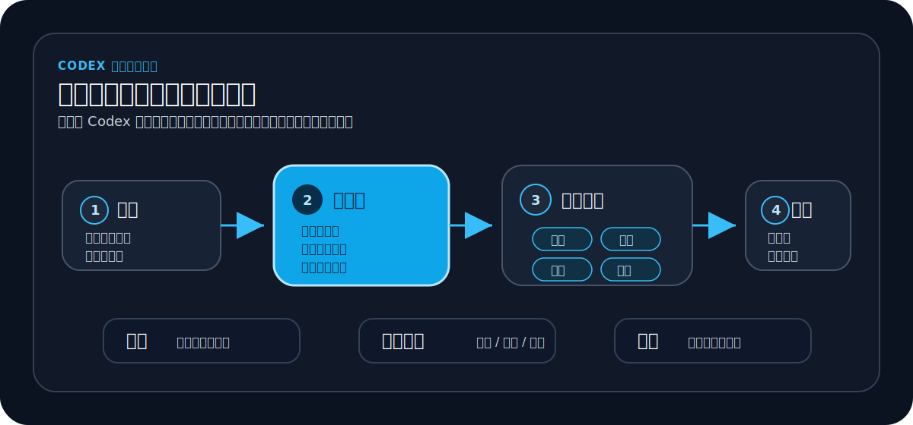
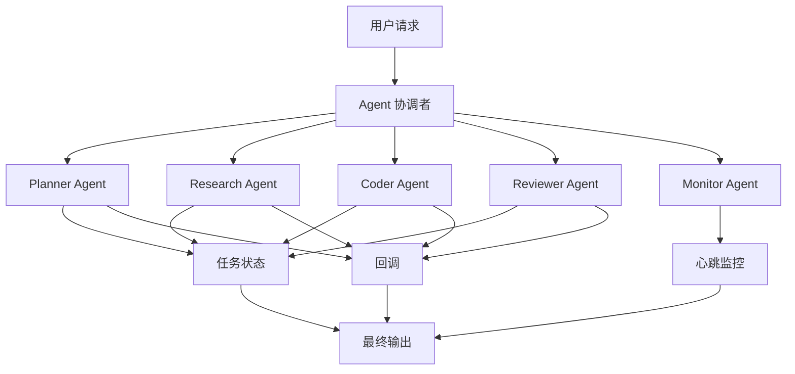

# Agent Orchestration Codex Skill

<p align="center">
  
</p>

<p align="center">
  <strong>让 Codex 里的多个 AI Agent 像一个小团队一样并行协作：角色分工、任务回调、心跳监控、结构化交接。</strong>
</p>

<p align="center">
  <a href="README.md">English</a> ·
  <a href="#快速开始">快速开始</a> ·
  <a href="#演示流程">演示流程</a> ·
  <a href="docs/examples.zh-CN.md">使用示例</a> ·
  <a href="docs/installation.zh-CN.md">安装说明</a>
</p>

<p align="center">
  <a href="https://github.com/lixuvip/agent-orchestration-skill/releases"></a>
  <a href="LICENSE"></a>
  <a href="https://github.com/lixuvip/agent-orchestration-skill/actions"></a>
  <a href="https://github.com/lixuvip/agent-orchestration-skill/stargazers"></a>
</p>



`agent-orchestration` 是一个轻量级 Codex skill，用于多代理编排、角色化任务分发、QA 验证、代码审查、发布协作、回调机制和心跳监控。它适合协调多个 Codex 线程、subagents、仓库或 worktree 中的复杂开发任务。

与其让一个 Agent 在一条很长的会话里独自处理所有事情，这个 skill 会让一个 Codex 会话担任协调者，把任务拆给 planner、researcher、coder、reviewer、release docs、QA 和 monitor 等角色，再由协调者检查证据、风险和最终交付。

## 快速入口

- [安装这个 skill](docs/installation.zh-CN.md)
- [3 分钟快速开始](docs/quickstart.zh-CN.md)
- [协调一次多项目发布](docs/tutorial.zh-CN.md)
- [复制可用示例 Prompt](docs/examples.zh-CN.md)：[研究任务](examples/simple-research-task.md)、[编码加审查](examples/coding-review-workflow.md)、[产品规划](examples/multi-agent-product-planning.md)
- [查看英文文档](README.md)
- [发布或 Fork 自己的版本](docs/publishing.zh-CN.md)

## 为什么需要它

Codex 很强，但复杂项目通常不适合只靠一个线性 Agent 线程完成。长任务容易出现进度不可见、上下文混杂、子任务遗漏、验证结果不清晰等问题。

这个 skill 增加了一个小型编排层，让 Codex 工作流更可观察、更模块化、更可靠：

- 把一个目标拆给多个角色化 Agent。
- 给每个角色明确可编辑范围、停止条件、验证要求和回调规则。
- 用 `DONE`、`DONE_WITH_CONCERNS`、`BLOCKED`、`NEEDS_CONTEXT` 跟踪任务状态。
- 对长时间运行或异步任务使用心跳监控。
- 要求协调者在最终交付前检查角色输出、风险和验证证据。

## 适用场景

- 多仓库改动，需要分别实现、验证和汇总。
- 产品、工程、QA、代码审查、发布文档等角色并行协作。
- 长时间运行的 Codex 线程，需要协调者轮询状态。
- 交接时必须明确变更文件、验证命令、风险和最终状态。
- 子线程完成后需要回调协调线程，并由定时心跳监控任务状态。
- AI coding workflow、研究加实现流水线、产品原型设计、多 Agent 实验。

## 快速开始

安装：

```bash
git clone https://github.com/lixuvip/agent-orchestration-skill.git
cd agent-orchestration-skill
./scripts/install.sh
```

在 Codex 中使用：

```text
Use $agent-orchestration to coordinate this bug fix with one engineering thread and one QA thread.

Goal:
Fix the failing export option in the report generation flow.

Constraints:
- Engineer may edit application and test code.
- QA is read-only and must run the regression tests.
- Both roles must report exact commands and results.
```

## 演示流程



## 核心角色

| 角色 | 作用 |
| --- | --- |
| Coordinator | 拆解目标、分发角色任务、跟踪状态、检查最终证据。 |
| Planner | 澄清范围、验收标准和任务顺序。 |
| Researcher | 收集上下文，不修改文件。 |
| Coder | 实现范围明确的改动，并报告具体变更文件。 |
| Reviewer | 检查质量、回归风险和高风险差异。 |
| QA Tester | 运行验证命令，并报告精确命令和结果。 |
| Monitor | 轮询长任务，在所有角色到达终态后关闭循环。 |

## 仓库结构

```text
.
├── skills/
│   └── agent-orchestration/
│       ├── SKILL.md
│       ├── agents/
│       │   └── openai.yaml
│       └── references/
│           ├── AUTOMATION_MONITORING.md
│           ├── COMMUNICATION_PROTOCOL.md
│           ├── PROJECT_CONTEXT.template.md
│           ├── ROLE_REGISTRY.template.md
│           ├── TASK_BOARD.template.md
│           ├── WORKFLOWS.md
│           ├── roles/
│           └── templates/
├── docs/
│   ├── installation.md
│   ├── installation.zh-CN.md
│   ├── quickstart.md
│   ├── quickstart.zh-CN.md
│   ├── tutorial.md
│   ├── tutorial.zh-CN.md
│   ├── examples.md
│   ├── examples.zh-CN.md
│   ├── publishing.md
│   └── publishing.zh-CN.md
├── examples/
├── scripts/
└── .github/workflows/validate.yml
```

## 安装

克隆仓库后运行安装脚本：

```bash
git clone https://github.com/lixuvip/agent-orchestration-skill.git
cd agent-orchestration-skill
./scripts/install.sh
```

默认安装到：

```text
${CODEX_SKILLS_DIR:-${CODEX_HOME:-$HOME/.codex}/skills}/agent-orchestration
```

如果你的 Codex 环境扫描 `$HOME/.agents/skills`，可以这样安装：

```bash
CODEX_SKILLS_DIR="$HOME/.agents/skills" ./scripts/install.sh
```

## 使用方式

在 Codex 中显式调用：

```text
Use $agent-orchestration to split this task across engineering, QA, and code review threads. Create a 5-minute heartbeat monitor and summarize the final status when all roles finish.
```

也可以描述一个符合场景的任务，让 Codex 自动选择这个 skill：

```text
Coordinate this release across three repositories. Have each project thread finish commits, document API contracts, and report verification results back to this coordinator thread.
```

## 基本流程

1. 协调者读取项目上下文并选择合适的工作流。
2. 协调者创建或选择角色线程。
3. 每个角色收到基于 `task_dispatch.template.md` 的明确任务。
4. 角色线程按照 `role_reply.template.md` 返回状态。
5. 长时间运行的多线程任务使用回调规则和 5 分钟心跳监控。
6. 协调者检查所有终态结果、验证证据和遗留风险，再给出最终汇总。

## 搜索关键词

Codex skill、OpenAI Codex、多代理编排、AI agent orchestration、multi-agent workflow、parallel agents、subagents、任务编排、角色化代理、callback workflow、heartbeat monitoring、structured handoff、coding agent、QA workflow、代码审查自动化、发布管理、开发者工具。

## 文档

- [安装说明](docs/installation.zh-CN.md)
- [快速开始](docs/quickstart.zh-CN.md)
- [教程](docs/tutorial.zh-CN.md)
- [使用示例](docs/examples.zh-CN.md)
- [发布指南](docs/publishing.zh-CN.md)

## 验证

运行仓库自带验证：

```bash
python3 scripts/validate.py
```

如果本地有 Codex 内置的 `skill-creator` 验证器，也可以运行：

```bash
python3 ~/.codex/skills/.system/skill-creator/scripts/quick_validate.py skills/agent-orchestration
```

## 发布前检查

发布前建议确认：

- 没有私有路径、真实客户信息、密钥、令牌或生产凭据。
- 示例项目名都是通用名称，不包含内部项目代号。
- README 中的 GitHub URL 已替换为真实公开仓库地址。
- `python3 scripts/validate.py` 通过。
- 安装脚本能在干净 checkout 上正常运行。

## 许可证

MIT License。详见 [LICENSE](LICENSE)。
