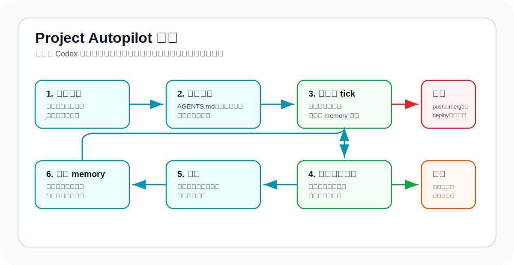
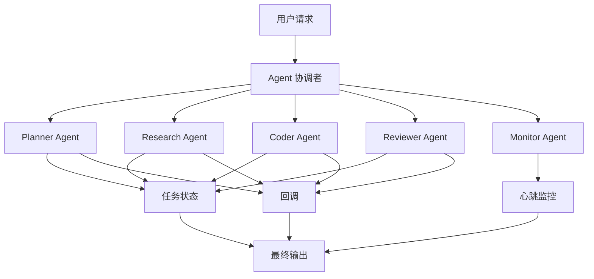

# Agent Orchestration Codex Skill

<p align="center">
  
</p>

<p align="center">
  <strong>让 Codex 主线程变成自适应协调者：分发角色线程、选择合适思考级别、接收回调、管理自动化并持续推进项目目标。</strong>
</p>

<p align="center">
  <a href="README.md">English</a> ·
  <a href="#快速开始">快速开始</a> ·
  <a href="#v021自适应角色对话">v0.2.1</a> ·
  <a href="#演示流程">演示流程</a> ·
  <a href="docs/examples.zh-CN.md">使用示例</a> ·
  <a href="docs/installation.zh-CN.md">安装说明</a>
</p>

<p align="center">
  <a href="https://github.com/lixuvip/agent-orchestration-skill/releases"></a>
  <a href="LICENSE"></a>
  <a href="https://github.com/lixuvip/agent-orchestration-skill/actions"></a>
  <a href="https://github.com/lixuvip/agent-orchestration-skill/stargazers"></a>
</p>


`agent-orchestration` 是一个面向复杂 Codex 工作流的协调 skill：当任务需要角色分工、用户可见线程、分支/worktree 交接、QA/Review 门禁、回调、有限期巡检、周期性项目推进，或者 `agy` / Gemini 外部第二意见时，由一个协调者统一管理范围、证据、权限和最终验收。

它不会把每个请求都变成多 Agent 流程，而是选择最低安全模式，只加载对应能力包和实际需要的模板。简单任务保持简单，复杂任务获得可恢复、可验证、可交接的执行契约。

每个新角色对话可以由主协调者选择最适合且工具支持的思考级别；可选 `agy` 审计必须主动确认，本机能力不可用时会快速降级，不反复等待。

## 选择合适的重量

| 模式 | 适用情况 | 运行时上下文 |
| --- | --- | --- |
| Lite | 当前对话内一次性完成，包括一次只读外部模型审查/调研。 | 不加载核心包，不创建 task board、回调信封、heartbeat、cron 或 memory。 |
| Standard | 多角色、异步/用户可见线程、跨仓库交接、有限期长任务或正式 QA/Review/Release 门禁。 | 只加载一个语言版本的 `COORDINATION_RUNBOOK.md` 和实际用到的模板。 |
| Durable | 必须周期运行或跨 tick 恢复，直到明确完成条件满足。 | Standard 能力包加同语言 `PROJECT_AUTOPILOT.md`，以及目标、记忆、租约、生命周期和升级模板。 |

路由不明显时，`scripts/route_orchestration.py` 会确定最低安全模式和精确模板集合。用户要求的轻模式不能绕过安全下限；外部审查/调研是独立 modifier，本身不会自动升级编排模式。

## v0.2.1：自适应角色对话

`v0.2.1` 在不增加运行负担的前提下，让角色对话创建更加自适应：新增任务适配的思考级别选择，以及可选 `agy` 审查/调研的授权与快速能力门。

| 更新 | 运行行为 | 实际价值 |
| --- | --- | --- |
| 最适合的子对话思考级别 | 协调者根据预期质量、歧义、风险和验证难度选择工具支持的最佳适配档位；成本只用于同等适配时的平局。 | 机械任务保持快速，架构、安全和高风险审查获得足够推理深度。 |
| 如实记录 thinking 回退 | 派发记录期望值、实际值和理由；不支持时记录 `INHERITED` 或 `UNSUPPORTED`；高风险回退向上取档。 | 使用者看到实际运行情况，不会把继承值误认为已成功设置。 |
| 可选 `agy` 授权 | 未点名外部模型的辅助审计只询问一次；拒绝或未确认时直接 Codex-only，不做任何探测。 | 外部审查不会静默启动，也不会拖慢普通代码审计。 |
| 可用性负缓存 | 确认后，每个目标/主机只检查一次；`AGY_UNAVAILABLE` 和 `AGY_UNHEALTHY` 只提示一次，并复用到目标或环境变化。 | 未安装时不再重复模型发现、健康检查或等待超时。 |

完整发布说明、兼容性说明和验证细节：[v0.2.1](docs/releases/v0.2.1.md)。

## 子对话思考级别选择

每次创建新的用户可见子对话时，主协调者都会在 Lite/Standard/Durable 路由之外单独评估认知难度，并选择最适合且工具支持的 `thinking`。预期质量、风险覆盖和验证可靠性优先；只有相邻级别同样适合时，才用延迟和成本选择较低级别。机械任务可能适合 `minimal` 或 `low`，常规实现通常适合 `medium`，模糊架构、安全或高风险审查可能需要 `high` 或 `xhigh`。精确级别不可用时，高风险或高歧义任务向上取档而不是向下取档。协调者会记录期望级别、实际级别和理由；除非用户明确指定，否则不更换 `model`；创建工具无法应用覆盖时如实记录 `INHERITED` 或 `UNSUPPORTED`。

## v0.2.0：渐进式编排

`v0.2.0` 把 `v0.1.4` 之后增加的能力统一成一套更轻、更稳的运行模型。

| 能力 | 提供什么 | 实际价值 |
| --- | --- | --- |
| 渐进加载 | `SKILL.md` 只有 42 行；14 份重叠核心参考合并为 4 个中英文能力包文件。 | 简单任务不背负重上下文，复杂任务仍有完整契约。 |
| 版本化回调 | `ORCHESTRATION_EVENT_V1` 携带 attempt、nonce、coordinator epoch、唯一 event ID 和精确产物身份。 | 重复或过期回调只做 no-op，不会污染当前状态。 |
| Commit 固定门禁 | 角色状态、门禁结论和协调者状态相互独立；QA/Review 绑定实际检查的 SHA。 | 角色 `DONE` 不能冒充验收，新代码 commit 会使旧证据失效。 |
| 可恢复自动化 | 文件锁租约、单调 fencing token、幂等键和 `ACTIVE -> DRAINING -> CLOSED`。 | 重叠或恢复的 tick 不能重复发消息、覆盖 memory 或关闭新运行。 |
| 持续项目推进 | 目标契约、项目指令、每 tick 一个安全动作、持久 memory、静默 no-op 和升级门禁。 | Autopilot 能持续向完成条件推进，但不会自行获得 merge、push、deploy 或扩大范围的权限。 |
| 有界外部审查/调研 | Sandboxed `agy` helper、allowlist 上下文、结构化输出检查和 Codex 自有质量台账。 | Gemini 保持只读第二意见，必须经过 Codex 验证和验收。 |
| 可审计安装 | 干净来源检查、staging 替换、provenance manifest、一致性校验、保留旧版、dry-run 和 restore。 | 本机安装来源可追踪、可验证、可回滚。 |
| 回归护栏 | 静态、smoke、forward、protocol、automation、routing、scale、内置 skill 和 diff 检查。 | 安全语义和上下文预算都成为可执行发布标准。 |

完整发布说明和迁移指南：[v0.2.0](docs/releases/v0.2.0.md)。

## 核心保证

- 每个委派任务只有一个 owner，并明确可编辑、只读和禁止范围。
- 重叠文件编辑必须隔离或串行；路由不能让共享写入自动变安全。
- 静默不代表完成；验证必须写明真实运行的命令及结果。
- 角色 `DONE` 只进入协调者检查，只有协调者 `ACCEPTED` 才是交付。
- QA/Review 证据只对实际检查的精确产物有效。
- recurring tick 在外部写入、消息、cleanup 和 memory commit 前重新验证 lease owner。
- merge、push、deploy、publish、破坏性动作、费用、密钥和范围扩大始终受用户/项目权限约束。

## 最适合的场景

- 工程分支需要只读 QA，并在完成后回调主协调线程。
- 多仓库或多个 worktree 需要围绕一个契约统一收口。
- 一次发布需要实现、QA、Review、文档和精确 merge-readiness 证据。
- 长任务需要有限期 heartbeat 监控和可靠清理。
- issue、PR、checklist 或 workspace 需要每隔几小时推进，直到可衡量完成条件通过。
- 高风险 diff 或设计决策需要独立 Codex 与 `agy` / Gemini 审查或调研。

如果只是单文件修改、解释或一次性调试，并不需要独立 owner、异步恢复、正式门禁或周期运行，就留在当前对话直接完成。

## 快速入口

- [安装这个 skill](docs/installation.zh-CN.md)
- [3 分钟快速开始](docs/quickstart.zh-CN.md)
- [查看 v0.2.1 发布说明](docs/releases/v0.2.1.md)
- [查看 v0.2.0 渐进式编排迁移指南](docs/releases/v0.2.0.md)
- [协调一次多项目发布](docs/tutorial.zh-CN.md)
- [复制可直接使用的 Prompt](docs/examples.zh-CN.md)
- [查看前向测试场景](docs/forward-tests.md)
- [查看英文文档](README.md)
- [发布或 Fork 自己的版本](docs/publishing.zh-CN.md)

## Project Autopilot

Project Autopilot 模式用于“持续推进项目直到 checklist 完成”“每小时检查并执行下一个安全动作”这类需求。



Autopilot 会结合：

- `AGENTS.md` / `AGENTS.override.md` 作为项目常驻规则。
- 目标契约：完成条件、权限、验证、频率和停止条件。
- heartbeat 自动化：当前线程回访和回调巡检。
- cron 自动化：workspace/worktree 级别的长期推进。
- automation memory：每次运行比较最新有效更新、已处理 event ID 和动作键，避免重复评论或重复工作。
- 文件锁租约和 fencing token：重叠 tick 不能同时执行，也不能覆盖更新的 memory。
- `ACTIVE -> DRAINING -> CLOSED` heartbeat 收尾：最终汇总只发一次，等待工具确认清理。
- 升级报告：遇到 merge、push、deploy、范围扩大或验证反复失败时交给用户决策。
- 前向测试场景和填充样例：覆盖 no-op tick、升级、目标契约和 automation memory。

## 可选 Agy / Gemini 审查

当本机已经安装 `agy`，协调者可以在 Codex 实现后或接受分支交付前，运行一次有边界的外部模型审查。一次性第二意见默认保持 Lite，只有整体任务确实需要时才升级 Standard 或 Durable。该流程使用 `references/AGY_GEMINI_REVIEW.md` 和 `references/templates/` 下的审查 prompt、质量评估模板和专属报告模板。

`agy` 是可选且必须主动确认的辅助能力。用户只说代码审计、没有点名外部模型时，协调者先询问一次是否加入 `agy`；拒绝或未确认就直接走 Codex-only，连探测都不执行。确认后，每个目标和主机只检测一次；缺失或不健康状态会缓存并只提示一次，直到目标或环境变化，或用户明确要求重检，才会再次尝试。

标准外部第二意见使用 `Gemini 3.5 Flash (High)`。范围较大或用户要求对比时，Codex reviewer 与 Gemini 独立审查，再由协调者对比共同命中、模型单独命中、被驳回 findings 和实际验证证据。`scripts/run_agy_print.py` 固定走 sandboxed print，拒绝编辑模式和关闭 sandbox，增加宿主超时与输出上限。diff-only 审查不挂仓库；需要源码时由 `scripts/build_agy_context_bundle.py` 生成 allowlist bundle。整仓披露、写入目标 `AGENTS.md`、项目内质量日志都需要单独授权。

## 可选 Agy / Gemini 外部调研

如果你想把 Gemini 也接入调研，而不是只做 review，协调者现在可以跑一条并行 Codex + Gemini 调研流程。这个流程使用 `references/AGY_GEMINI_RESEARCH.md` 和 `references/templates/` 里的调研 prompt、质量评估、质量日志和专属报告模板。

调研同样遵循主动确认和可用性缓存：未确认时不探测 `agy`；工具不可用时立即降级为 Codex-only，不在本轮反复重试。

标准调研模型同样使用 `Gemini 3.5 Flash (High)`。Codex 仍负责读取仓库并用一手来源核验时效性事实；外部流只接收有界 prompt 或 allowlist bundle，不自动扩大为整仓披露。最终报告对比共同观点、Gemini-only、Codex-only 和驳回/推测性观点，质量记录以 `task_type=research` 写入默认 Codex 外部任务台账。

## 快速开始

安装：

```bash
git clone https://github.com/lixuvip/agent-orchestration-skill.git
cd agent-orchestration-skill
./scripts/install.sh
```

在 Codex 中使用：

```text
Use $agent-orchestration to coordinate this bug fix with one engineering thread and one QA thread.

Goal:
Fix the failing export option in the report generation flow.

Constraints:
- Engineer may edit application and test code.
- QA is read-only and must run the regression tests.
- Both roles must report exact commands and results.
```

## 演示流程



## 核心角色

| 角色 | 作用 |
| --- | --- |
| Coordinator | 拆解目标、分发角色任务、跟踪状态、检查最终证据。 |
| Planner | 澄清范围、验收标准和任务顺序。 |
| Researcher | 收集上下文，不修改文件。 |
| Coder | 实现范围明确的改动，并报告具体变更文件。 |
| Reviewer | 检查质量、回归风险和高风险差异。 |
| QA Tester | 运行验证命令，并报告精确命令和结果。 |
| Monitor | 巡检长任务，把角色终态汇总到协调者验收，并关闭 automation lifecycle。 |

## 仓库结构

```text
.
├── skills/
│   └── agent-orchestration/
│       ├── SKILL.md
│       ├── agents/
│       │   └── openai.yaml
│       ├── scripts/
│       │   ├── automation_lease.py
│       │   ├── heartbeat_lifecycle.py
│       │   ├── orchestration_event.py
│       │   └── route_orchestration.py
│       └── references/
│           ├── AGY_GEMINI_REVIEW.md
│           ├── AGY_GEMINI_RESEARCH.md
│           ├── COORDINATION_RUNBOOK.md
│           ├── COORDINATION_RUNBOOK.zh-CN.md
│           ├── PROJECT_AUTOPILOT.md
│           ├── PROJECT_AUTOPILOT.zh-CN.md
│           ├── PROJECT_CONTEXT.template.md
│           ├── ROLE_REGISTRY.template.md
│           ├── TASK_BOARD.template.md
│           ├── examples/
│           ├── roles/
│           └── templates/
├── docs/
│   ├── installation.md
│   ├── installation.zh-CN.md
│   ├── quickstart.md
│   ├── quickstart.zh-CN.md
│   ├── tutorial.md
│   ├── tutorial.zh-CN.md
│   ├── examples.md
│   ├── examples.zh-CN.md
│   ├── forward-tests.md
│   ├── images/
│   ├── releases/
│   ├── publishing.md
│   └── publishing.zh-CN.md
├── examples/
├── scripts/
│   ├── install.sh
│   ├── install_skill.py
│   ├── automation_test.py
│   ├── protocol_test.py
│   ├── routing_test.py
│   ├── scale_test.py
│   ├── smoke_test.py
│   ├── forward_test.py
│   └── validate.py
└── .github/workflows/validate.yml
```

## 安装

克隆仓库后运行安装脚本：

```bash
git clone https://github.com/lixuvip/agent-orchestration-skill.git
cd agent-orchestration-skill
./scripts/install.sh
```

默认安装到：

```text
${CODEX_SKILLS_DIR:-${CODEX_HOME:-$HOME/.codex}/skills}/agent-orchestration
```

安装器会先运行验证，默认拒绝 dirty 来源，以 staging 方式替换，记录来源 provenance，并保留上一份安装用于回滚。可用 `./scripts/install.sh --dry-run` 预览；只有明确要安装本地未提交快照时才使用 `--allow-dirty`；用 `./scripts/install.sh --restore` 恢复保留的上一版本。

如果你的 Codex 环境扫描 `$HOME/.agents/skills`，可以这样安装：

```bash
CODEX_SKILLS_DIR="$HOME/.agents/skills" ./scripts/install.sh
```

## 使用方式

在 Codex 中显式调用：

```text
Use $agent-orchestration to split this task across engineering, QA, and code review threads. Create a 5-minute heartbeat monitor and summarize the final status when all roles finish.
```

也可以描述一个符合场景的任务，让 Codex 自动选择这个 skill：

```text
Coordinate this release across three repositories. Have each project thread finish commits, document API contracts, and report verification results back to this coordinator thread.
```

## 基本流程

1. 协调者先选择最低安全的 Lite、Standard 或 Durable。
2. Standard/Durable 为异步任务生成派发身份，并按需要选择隔离线程、分支或 worktree。
3. 异步角色按 `task_dispatch.template.md` 接收版本化任务，并用 `ORCHESTRATION_EVENT_V1` 回复。
4. 协调者先校验、去重并拒绝过期回调，再更新状态。
5. 长时间 Standard 使用带租约的 heartbeat；Durable 使用目标契约、memory、cron 和 fencing。
6. 角色终态只把任务送入 `IN_REVIEW`；当前产物门禁通过后，协调者才能验收交付。

## 搜索关键词

Codex skill、OpenAI Codex、AGENTS.md、AGENTS.override.md、多代理编排、AI agent orchestration、multi-agent workflow、project autopilot、Codex automations、cron automation、heartbeat automation、GitHub issue automation、PR automation、parallel agents、subagents、任务编排、角色化代理、callback workflow、heartbeat monitoring、structured handoff、coding agent、QA workflow、代码审查自动化、agy Gemini 审查、agy Gemini 调研、Antigravity 审查、外部模型审查、外部模型调研、并行调研、发布管理、开发者工具。

## 文档

- [安装说明](docs/installation.zh-CN.md)
- [快速开始](docs/quickstart.zh-CN.md)
- [教程](docs/tutorial.zh-CN.md)
- [使用示例](docs/examples.zh-CN.md)
- [前向测试场景](docs/forward-tests.md)
- [发布指南](docs/publishing.zh-CN.md)

## 验证

运行仓库自带验证：

```bash
python3 scripts/validate.py
python3 scripts/smoke_test.py
python3 scripts/forward_test.py
python3 scripts/protocol_test.py
python3 scripts/automation_test.py
python3 scripts/routing_test.py
python3 scripts/scale_test.py
git diff --check
```

如果本地有 Codex 内置的 `skill-creator` 验证器，也可以运行：

```bash
python3 ~/.codex/skills/.system/skill-creator/scripts/quick_validate.py skills/agent-orchestration
```

## 发布前检查

发布前建议确认：

- 没有私有路径、真实客户信息、密钥、令牌或生产凭据。
- 示例项目名都是通用名称，不包含内部项目代号。
- README 中的 GitHub URL 已替换为真实公开仓库地址。
- `validate.py`、`smoke_test.py`、`forward_test.py`、`protocol_test.py`、`automation_test.py`、`routing_test.py`、`scale_test.py` 和 `git diff --check` 全部通过。
- 安装脚本能在干净 checkout 上正常运行。

## 许可证

MIT License。详见 [LICENSE](LICENSE)。
